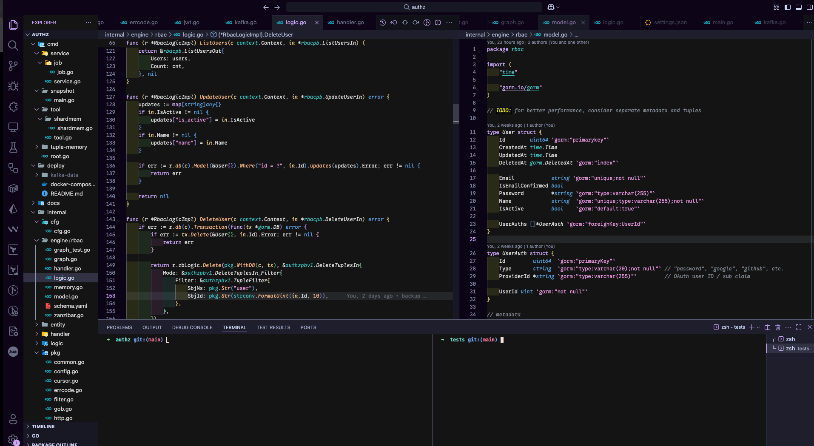

# Whisper

An elegant and implicit theme for Visual Studio Code, designed for a focused and enjoyable coding experience.



## Overview

Whisper is a dark theme that combines subtlety with clarity. Its carefully selected color palette, based on the popular [Catppuccin Mocha](https://github.com/catppuccin/catppuccin), reduces visual noise and helps you focus on what matters most: your code.

While the theme is designed to be aesthetically pleasing for any language, it includes specific optimizations for Go, providing enhanced semantic highlighting for a more intuitive development workflow.

## Features

- **Minimalist Design**: A clean and unobtrusive interface that stays out of your way.
- **Soothing Colors**: A harmonious color scheme that is easy on the eyes, perfect for long coding sessions.
- **Optimized for Go**: Fine-tuned syntax highlighting for the Go programming language.
- **Semantic Highlighting**: Leverages semantic tokens to provide richer and more meaningful code coloration.

## Installation

1.  Open **Visual Studio Code**.
2.  Go to the **Extensions** view (`Ctrl+Shift+X`).
3.  Search for "Whisper" and click **Install**.
4.  Go to **File > Preferences > Color Theme** and select **Whisper**.

## Recommended Settings

For the best experience, especially for Go development, add the following to your `settings.json` file:

<details>
<summary>Click to expand settings.json</summary>

```json
"editor.semanticHighlighting.enabled": true,
"editor.tokenColorCustomizations": {
    "textMateRules": [
        {
            "name": "Go type names (fallback)",
            "scope": [
                "entity.name.import.go",
            ],
            "settings": { "foreground": "#CBA6F7" }
        },
        {
            "name": "go.mod",
            "scope": [
                "string.unquoted.go.mod"
            ],
            "settings": { "foreground": "#D6D6D6" }
        },
    ]
},
"gopls": {
    "ui.semanticTokens": true
}
```

</details>

## License

This theme is released under the [MIT License](LICENSE).
